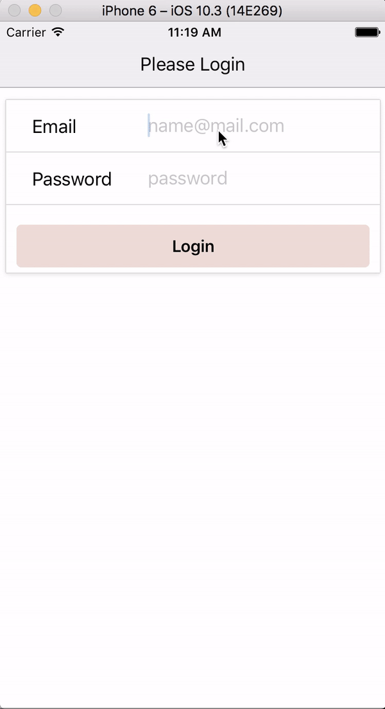

# Habitizer

App built with React Native & Redux. Backed up with Firebase database

## First mockup of App

The app is built to add tasks you wan to do every week, to remind you to keep habits.

  

#Current state of app
In the application you can sign up as a new user, or login as an existing one in the same form. Once logged in you can add new habits, edit and delete existing ones and easily keep track of chores you want to remember to do every week!

> By: Frida Sjöholm
